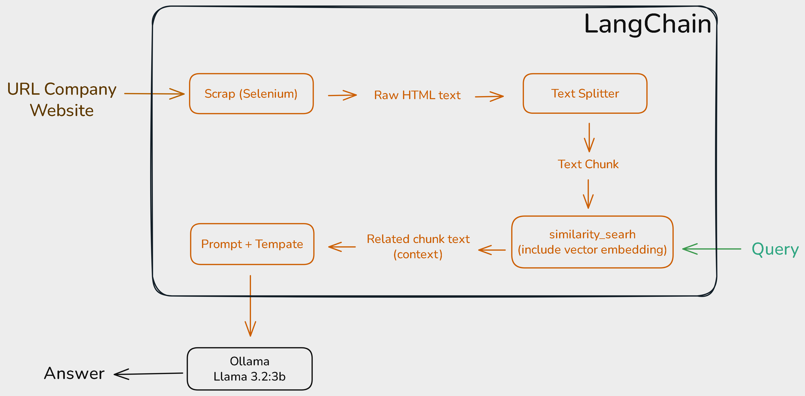

# 🦎 LeadSightAI

[](https://www.python.org/)
[](https://streamlit.io/)
[](https://pandas.pydata.org/)
[](https://openpyxl.readthedocs.io/)
[](https://www.selenium.dev/)
[](https://github.com/langchain-ai/langchain)
[](https://github.com/langchain-ai/langchain)

---

## 📝 About the Project
**LeadSightAI** is a Streamlit-based application designed to help users discover and analyze company information for lead generation and business intelligence. It features a searchable company database and an interactive ChatRAG (Retrieval-Augmented Generation) interface, allowing users to extract insights from company websites. With built-in export options for CSV and Excel, it’s a practical tool for marketers, analysts, and researchers.


## 📝 About the Project
LeadSightAI is a Streamlit-based application designed to assist users in discovering and analyzing company information for lead generation and business intelligence. It combines a searchable company database with an interactive ChatRAG (Retrieval-Augmented Generation) feature, enabling users to extract insights from company websites. With built-in export options for CSV and Excel, it’s a practical tool for marketers, analysts, and researchers looking to streamline their workflows.

---

## 🎯 Purpose
- Provide an intuitive interface to filter and explore company data by industry, location, and keywords.
- Offer real-time ChatRAG interactions to dive deeper into company details using web-scraped content.
- Enable easy data export for further analysis or reporting.
- Serve as a foundation for future enhancements in AI-driven lead generation.

---

## 🌟 Key Features
- **Company Search Dashboard**: Filter companies with customizable criteria and view detailed profiles.
- **ChatRAG Integration**: Engage in conversational queries about selected companies using RAG with OllamaLLM.
- **Data Export**: Download filtered company data in CSV or Excel formats.
- **Dynamic Scraping**: Utilize SeleniumURLLoader to fetch and process live website content.

---

## 🛠️ Technology Stack
| Component         | Tool/Technology      | Purpose                          |
|-------------------|----------------------|----------------------------------|
| **UI Framework**  | Streamlit            | Interactive and responsive dashboard |
| **Scraping**      | SeleniumURLLoader    | Extract data from dynamic websites  |
| **Language Model**| OllamaLLM (Llama 3.2:3b)            | Power ChatRAG with local LLM       |
| **Vector Storage**| InMemoryVectorStore  | Store and retrieve document chunks |
| **Data Handling** | Pandas               | Manage and export company data     |

---

## 🏗️ How It Works
1. **Explore Companies**: Use the dashboard to search and filter companies based on industry, location, or name.
2. **Select a Company**: Click "Chat" to initiate a ChatRAG session for a specific company.
3. **Scrape Content**: The app scrapes the company’s website using SeleniumURLLoader.
4. **Generate Insights**: ChatRAG processes the scraped data with OllamaLLM to answer your questions.
5. **Export Results**: Save filtered company data to CSV or Excel for offline use.

---

## 🏗️ Architecture Diagram


---

## ⚙️ Getting Started

### 📥 Installation
1. Clone the repository
```bash
git clone https://github.com/yourusername/leadsightai.git
cd leadsightai
```

2. Create and activate a virtual environment
```bash
python3 -m venv venv

# On macOS/Linux:
source venv/bin/activate

# On Windows:
venv\Scripts\activate
```

3. Install dependencies
```bash
pip install -r requirements.txt
```

4. Pull the Ollama Model 
```bash
ollama pull llama3.2:3b
```

5. Run the app
```bash
streamlit run app.py
```

### 🌐 Prerequisites
- Python 3.8 or higher
- Internet connection (for live scraping)
- Optional: Update `config.py` to customize OllamaLLM settings

---

## 📁 Project Structure
```bash
leadsightai/
├── app.py                  # Main Streamlit app
├── config.py               # Configuration for LLM and settings
├── requirements.txt        # Required Python packages
├── static/
│   └── styles.css          # Custom UI styling
├── modules/
│   ├── data_handling.py    # Company data management
│   ├── scraping.py         # Website scraping logic
│   ├── chat_rag.py         # ChatRAG and LLM pipeline
│   └── ui_components.py    # UI components and layout
└── data/
    └── company_data.csv    # Sample dataset
```

---

## 📬 Contact & Contributions
Feel free to fork or submit issues! Created by [@kderrylo](https://github.com/kderrylo) for exploration and research in lead generation tools using open-source LLMs.
